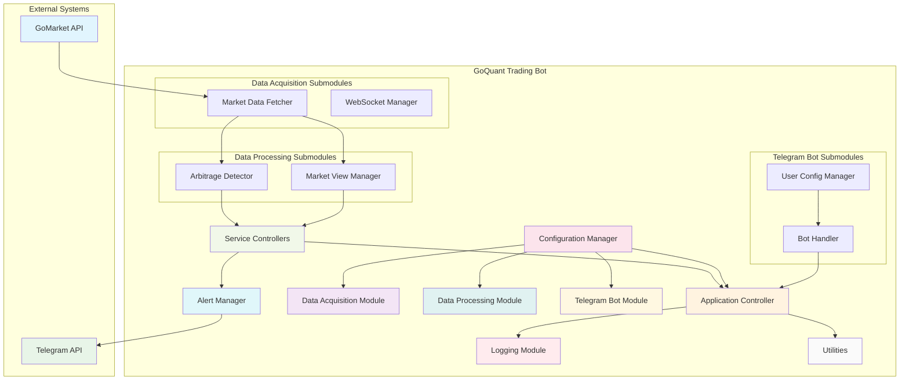

```mermaid
graph TB
    subgraph "External Systems"
        A[GoMarket API]
        B[Telegram API]
    end

    subgraph "GoQuant Trading Bot"
        C[Application Controller]
        D[Configuration Manager]
        E[Data Acquisition Module]
        F[Data Processing Module]
        G[Telegram Bot Module]
        H[Service Controllers]
        I[Alert Manager]
        J[Logging Module]
        K[Utilities]
        
        subgraph "Data Processing Submodules"
            F1[Arbitrage Detector]
            F2[Market View Manager]
        end
        
        subgraph "Data Acquisition Submodules"
            E1[Market Data Fetcher]
            E2[WebSocket Manager]
        end
        
        subgraph "Telegram Bot Submodules"
            G1[Bot Handler]
            G2[User Config Manager]
        end
    end

    A --> E1
    E1 --> F1
    E1 --> F2
    F1 --> H
    F2 --> H
    H --> C
    H --> I
    I --> B
    D --> C
    D --> E
    D --> F
    D --> G
    G1 --> C
    G2 --> G1
    C --> J
    C --> K

    style A fill:#e1f5fe
    style B fill:#e8f5e8
    style C fill:#fff3e0
    style D fill:#fce4ec
    style E fill:#f3e5f5
    style F fill:#e0f2f1
    style G fill:#fff8e1
    style H fill:#f1f8e9
    style I fill:#e0f7fa
    style J fill:#ffebee
    style K fill:#fafafa
```