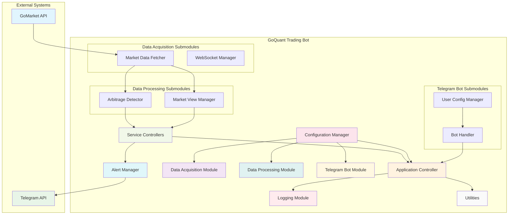

# System Architecture

## Overview

The GoQuant Trading Bot is a sophisticated trading information system that uses GoMarket data product with a Telegram bot interface. The system is designed with a modular architecture that separates concerns and enables maintainability, scalability, and testability.

The system has two main services:

1. **Multi-Exchange, Multi-Asset Arbitrage Signal Service**
2. **Consolidated Market View & Venue Signaling Service**

## Overall Architecture Diagram

## Module Descriptions

### 1. Application Controller

**Purpose**: Centralized control for all application components, managing the main application lifecycle including initialization, event loop, and graceful shutdown.

**Inputs**: 
- Configuration settings from environment variables
- User commands from Telegram bot
- System signals (SIGINT, SIGTERM)

**Outputs**: 
- Coordinated operation of all system modules
- Graceful application startup and shutdown
- Event loop management

**Key Features**:
- **Centralized Control**: Single point of control for all application components
- **Graceful Initialization**: Proper initialization of all modules in correct order
- **Event Loop Management**: Main application event loop with proper timing
- **Signal Handling**: Graceful shutdown on SIGINT and SIGTERM
- **Error Handling**: Comprehensive error handling throughout the application lifecycle

### 2. Configuration Manager

**Purpose**: Manages all configuration settings for the trading bot, including API keys, thresholds, and user preferences.

**Inputs**:
- Environment variables (`.env` file)
- Runtime configuration updates
- User-specific settings

**Outputs**:
- Configuration values for all modules
- Default values for unset parameters
- Validation of configuration parameters

**Key Features**:
- **Environment Variable Management**: Secure handling of sensitive configuration data
- **Default Values**: Sensible defaults for all configuration parameters
- **Validation**: Comprehensive validation of configuration parameters
- **Runtime Updates**: Support for dynamic configuration updates

### 3. Data Acquisition Module

**Purpose**: Connects to the GoMarket APIs and fetches market data from multiple exchanges.

**Inputs**:
- Exchange names and symbols to monitor
- API credentials from configuration
- User monitoring requests

**Outputs**:
- Market data (L1 and L2) from multiple exchanges
- Real-time data streams via WebSocket
- Symbol lists from exchanges

**Key Features**:
- **Symbol Discovery**: Automatic discovery of available trading symbols
- **L1 Market Data**: Best bid/offer and last trade prices
- **L2 Order Book Data**: Full order book depth data
- **REST API Polling**: Fallback mechanism for data fetching
- **WebSocket Streaming**: Real-time data streaming
- **Rate Limiting Protection**: Automatic handling of API rate limits
- **Error Handling**: Comprehensive error handling for network issues

### 4. Data Processing Module

**Purpose**: Processes market data to detect arbitrage opportunities and calculate consolidated market views.

**Inputs**:
- Market data from Data Acquisition Module
- User-configured thresholds
- Monitoring parameters

**Outputs**:
- Detected arbitrage opportunities
- Consolidated market views (CBBO)
- Processed analytics data

**Submodules**:

#### 4.1 Arbitrage Detector

**Purpose**: Identifies profitable trading opportunities across multiple exchanges by comparing prices for the same assets.

**Algorithm**:
1. Fetch current market data for specified symbols across exchanges
2. Compare buy prices (asks) and sell prices (bids) between exchanges
3. Calculate potential profit percentage and absolute value
4. Filter opportunities based on user-configured thresholds
5. Track active opportunities and their durations

**Configuration**:
- **Percentage Threshold**: Minimum profit percentage (default: 0.5%)
- **Absolute Threshold**: Minimum profit in absolute value (default: $1.0)
- **Monitoring Assets**: List of assets to monitor
- **Exchanges**: List of exchanges to include in arbitrage detection

#### 4.2 Market View Manager

**Purpose**: Provides consolidated market data across multiple exchanges, including CBBO (Consolidated Best Bid/Offer) calculations.

**Calculations**:
- **CBBO Calculation**: Determine best bid/offer prices across all monitored exchanges
- **Venue Identification**: Identify which exchange has the best bid/offer
- **Spread Analysis**: Calculate price spreads between exchanges
- **Market Depth Analysis**: Analyze order book depth information

**Configuration**:
- **Symbols**: Trading symbols to monitor
- **Exchanges**: Exchanges to include in market view
- **Update Frequency**: How often to update market data
- **Change Thresholds**: Significant change thresholds for alerts

### 5. Telegram Bot Module

**Purpose**: Provides a user interface through Telegram for controlling the trading bot and receiving alerts.

**Inputs**:
- User commands via Telegram messages
- User configuration updates
- Alert requests from services

**Outputs**:
- Formatted alerts and notifications
- Interactive menus and buttons
- Configuration management interface
- Status information

**Submodules**:

#### 5.1 Bot Handler

**Purpose**: Handles all Telegram bot interactions including commands, messages, and callbacks.

**Commands**:
- **Basic Commands**: `/start`, `/help`, `/status`, `/list_symbols`, `/menu`, `/alerts`, `/config`
- **Arbitrage Commands**: `/monitor_arb`, `/stop_arb`, `/config_arb`, `/status_arb`, `/threshold`, `/arbitrage`
- **Market View Commands**: `/view_market`, `/stop_market`, `/get_cbbo`, `/config_market`, `/status_market`

**Interactions**:
- **Interactive Menus**: Button-based navigation for configuration
- **Real-time Updates**: Live message editing for monitoring status
- **User Configuration**: Interactive configuration management
- **Alert Management**: Alert enabling/disabling

#### 5.2 User Config Manager

**Purpose**: Manages user-specific configuration settings and preferences.

**Storage**:
- **Persistent Storage**: JSON files for user configurations
- **In-Memory Caching**: Fast access to active configurations
- **Automatic Saving**: Configuration persistence on shutdown

**Validation**:
- **Exchange Validation**: Check against supported exchanges
- **Symbol Validation**: Validate symbol formats
- **Threshold Validation**: Ensure numerical thresholds are valid
- **Limit Validation**: Validate monitoring limits

### 6. Service Controllers

**Purpose**: Manages the lifecycle of both monitoring services (Arbitrage Signal Service and Market View Service).

**Inputs**:
- User commands to start/stop services
- Configuration parameters
- Monitoring requests

**Outputs**:
- Service status information
- Resource management
- Thread coordination

**Key Features**:
- **Service Lifecycle Management**: Start, stop, and monitor both services
- **Concurrent Operation**: Both services can run simultaneously
- **Resource Management**: Proper cleanup of resources on stop
- **Status Reporting**: Detailed status information for both services
- **Thread Safety**: Safe concurrent operation of services

### 7. Alert Manager

**Purpose**: Sends formatted notifications to Telegram for arbitrage opportunities and market view updates.

**Inputs**:
- Detected arbitrage opportunities
- Market view updates
- User subscription requests

**Outputs**:
- Formatted Telegram messages
- Alert history
- Subscriber management

**Key Features**:
- **Formatted Alerts**: Professional, structured message formatting
- **Subscriber Management**: Track which chats should receive alerts
- **Message Tracking**: Track sent messages for editing/updating
- **Rate Limiting**: Prevent spam and respect Telegram API limits
- **Error Handling**: Robust error handling with retry logic
- **Alert History**: Maintain history of recent alerts

### 8. Logging Module

**Purpose**: Provides comprehensive logging throughout the system for debugging and monitoring.

**Inputs**:
- Log messages from all modules
- Error information
- Performance metrics

**Outputs**:
- Log files with rotation
- Console output
- Structured log data

**Key Features**:
- **Multi-Level Logging**: DEBUG, INFO, WARNING, ERROR, CRITICAL levels
- **File and Console Output**: Log to both files and console
- **Log Rotation**: Automatic rotation of log files to prevent disk space issues
- **Detailed Context**: Comprehensive logging with timestamps, module names, and function information

### 9. Utilities

**Purpose**: Provides utility functions and error handling mechanisms used throughout the system.

**Components**:
- **Error Handler**: Custom exception hierarchy and handling utilities
- **Helper Functions**: Common utility functions
- **Validation Functions**: Input and data validation utilities

## Data Flow Documentation

### 1. Data Flow from GoMarket to Processing

1. **Symbol Discovery**:
   - Configuration Manager provides API credentials
   - Market Data Fetcher requests symbol lists from all exchanges
   - GoMarket API responds with available symbols
   - Symbols are cached for monitoring

2. **Market Data Acquisition**:
   - Service Controllers initiate monitoring requests
   - Market Data Fetcher requests L1/L2 data for specified symbols
   - GoMarket API provides market data
   - Data is validated and cached

3. **Real-time Data Streaming**:
   - WebSocket Manager establishes connections for real-time data
   - GoMarket WebSocket streams market data updates
   - Data is processed and distributed to subscribers

### 2. Processing Results to Alerts

1. **Arbitrage Detection**:
   - Arbitrage Detector compares prices across exchanges
   - Profitable opportunities are identified and validated
   - Opportunities meeting thresholds trigger alerts

2. **Market View Calculation**:
   - Market View Manager calculates CBBO across exchanges
   - Consolidated views are generated
   - Significant changes trigger alerts

3. **Alert Generation**:
   - Alert Manager formats opportunity/market data into messages
   - Messages are sent to subscribed Telegram chats
   - Message IDs are tracked for potential updates

### 3. User Commands to System Behavior

1. **Command Reception**:
   - Bot Handler receives Telegram commands
   - Commands are parsed and validated
   - Appropriate handlers are invoked

2. **Configuration Updates**:
   - User Config Manager updates settings based on commands
   - New configurations are validated and saved
   - Services are notified of configuration changes

3. **Service Control**:
   - Service Controllers start/stop monitoring based on commands
   - Resources are allocated/deallocated
   - Status updates are sent to users

## Technology Choices

### Why WebSocket or REST Polling

The system uses both WebSocket and REST polling for data acquisition:

**WebSocket**:
- **Real-time Updates**: Immediate delivery of market data changes
- **Efficiency**: Reduced network overhead compared to polling
- **Scalability**: Better resource utilization for high-frequency data

**REST Polling**:
- **Reliability**: Fallback mechanism when WebSocket connections fail
- **Simplicity**: Easier to implement and debug
- **Compatibility**: Works with all API endpoints

The system uses a hybrid approach where WebSocket is preferred for real-time data, with REST polling as a fallback.

### Why Specific Python Libraries

**python-telegram-bot**:
- **Mature Library**: Well-established with comprehensive documentation
- **Active Development**: Regular updates and bug fixes
- **Feature Rich**: Supports all required Telegram bot features
- **Easy Integration**: Simple API for command handling and message formatting

**requests**:
- **Simplicity**: Easy-to-use HTTP library
- **Reliability**: Well-tested and stable
- **Flexibility**: Supports all required HTTP operations

**websocket-client**:
- **WebSocket Support**: Native WebSocket implementation
- **Compatibility**: Works well with Python's standard library
- **Error Handling**: Comprehensive error handling capabilities

### Architectural Patterns Used

1. **Modular Architecture**: Separation of concerns with distinct modules
2. **Observer Pattern**: Event-driven communication between components
3. **Singleton Pattern**: Single instances for configuration and logging
4. **Factory Pattern**: Dynamic creation of service components
5. **Decorator Pattern**: Error handling decorators for consistent exception management
6. **MVC Pattern**: Model-View-Controller separation in Telegram bot implementation

## Assumptions and Limitations

### Assumptions about GoMarket API Behavior

1. **API Availability**: The GoMarket API is available and responsive
2. **Data Consistency**: Market data is consistent across exchanges
3. **Rate Limiting**: API rate limits are reasonable and documented
4. **Authentication**: API authentication is stable and secure
5. **Data Format**: Market data follows documented formats
6. **WebSocket Support**: WebSocket connections are stable and reliable

### System Limitations

1. **Concurrent Monitors**:
   - Maximum of 10 concurrent arbitrage monitors per user
   - Maximum of 20 concurrent market view monitors per user
   - System-wide limit of 100 total monitors

2. **Supported Exchanges**:
   - Currently supports only Binance, OKX, Bybit, and Deribit SPOT markets
   - No support for futures or other derivative products

3. **Data Latency**:
   - REST polling introduces some data latency (1-5 seconds)
   - WebSocket connections may experience brief interruptions

4. **Resource Constraints**:
   - Memory usage increases with number of active monitors
   - CPU usage scales with monitoring frequency
   - Network bandwidth requirements grow with data volume

### Rate Limit Considerations

1. **GoMarket API Limits**:
   - 1000 requests per minute per API key
   - 10 concurrent WebSocket connections per API key
   - Automatic rate limiting with exponential backoff

2. **Telegram API Limits**:
   - 30 messages per second to different users
   - 20 messages per minute to the same user
   - Rate limiting handled automatically by Alert Manager

3. **Internal Rate Limiting**:
   - 0.1 second delay between REST API requests to avoid rate limiting
   - Message queuing for Telegram alerts
   - Connection pooling for efficient resource usage

## Performance Considerations

1. **Caching Strategy**:
   - Market data caching to reduce API calls
   - Configuration caching for fast access
   - Alert message caching for editing

2. **Threading Model**:
   - Main thread for application control
   - Separate threads for each monitoring service
   - WebSocket threads for real-time data
   - Telegram bot thread for message handling

3. **Memory Management**:
   - Circular buffers for alert history
   - Automatic cleanup of stale data
   - Efficient data structures for market data

4. **Network Optimization**:
   - Connection reuse for REST API calls
   - Efficient WebSocket message handling
   - Batch processing of multiple symbols

## Security Considerations

1. **API Key Security**:
   - Environment variable storage for sensitive credentials
   - No hardcoding of API keys in source code
   - Secure file permissions for configuration files

2. **Data Validation**:
   - Input validation for all user commands
   - Data sanitization for market data
   - Protection against injection attacks

3. **Error Handling**:
   - No exposure of sensitive information in error messages
   - Secure error logging without credentials
   - Graceful degradation on security-related errors